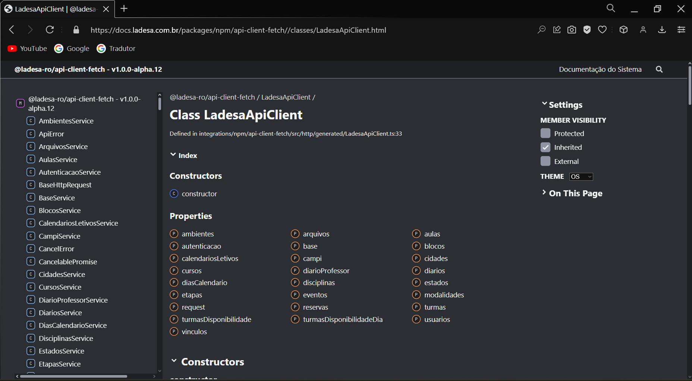
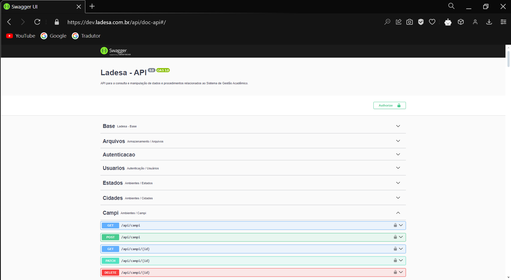

import SourceApiClient from "!!raw-loader!./.parts/snippets/code-example-composable.ts";
import SourceCursoCreateVue from "!!raw-loader!./.parts/snippets/code-example-create-curso.vue";
import CodeBlock from "@theme/CodeBlock";

# Integração a Web API utilizando Vue/Nuxt

A forma recomendada de interagir com a Web API do Ladesa é utilizando a classe `LadesaApiClient`. Você pode explorar a estrutura dessa classe [neste link][api-client-doc-ladesa-api-client].

Essa classe fornece vários métodos disponíveis que fazem as chamadas automáticamente para cada ação disponível na [documentação swagger da api][api-doc-swagger].

## CRUD

Um recurso no sistema geralmente possui pelo menos quatro formas de interação chamada pelo termo em inglês _CRUD_. Esse termo é utilizado para descrever as operações de cadastro, leitura, atualização e remoção.

- C: create - cadastro;
- R: read - consulta;
- U: update - atualização;
- D: delete - remoção.

### Exemplos de código

#### Composable para utilizar o apiClient

<CodeBlock language="ts">{SourceApiClient}</CodeBlock>

#### Cadastro de um curso

##### Cadastrar curso utilizando o LadesaApiClient

Para cadastrar um curso no sistema por meio do LadesaApiClient, você pode utilizar o método [`cursoCreate`][api-client-doc-ladesa-api-client-cursos-curso-create].

<CodeBlock language="vue">{SourceCursoCreateVue}</CodeBlock>

{/* <<< ./.parts/snippets/code-example-create-curso.vue [components/Cursos/Create.vue] */}

[api-doc-swagger]: https://dev.ladesa.com.br/api/doc-api
[api-client-doc-ladesa-api-client]: https://docs.ladesa.com.br/packages/npm/api-client-fetch//classes/LadesaApiClient.html
[api-client-doc-ladesa-api-client-cursos-curso-create]: https://docs.ladesa.com.br/packages/npm/api-client-fetch/classes/CursosService.html#cursoCreate
