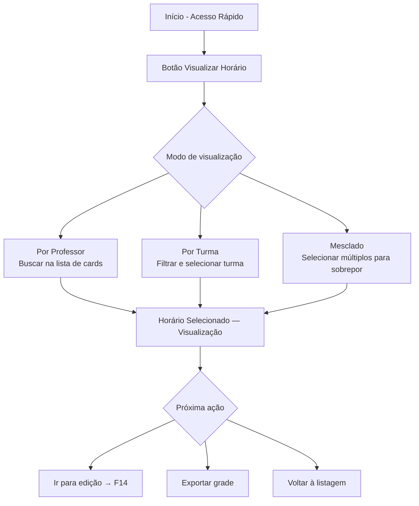
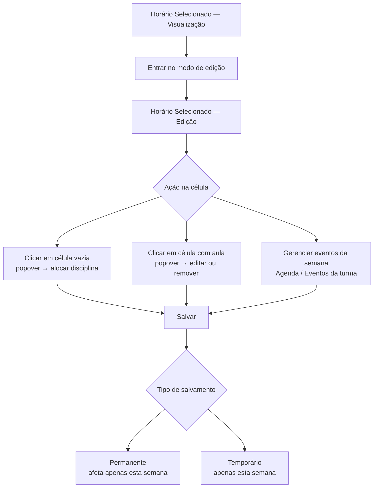
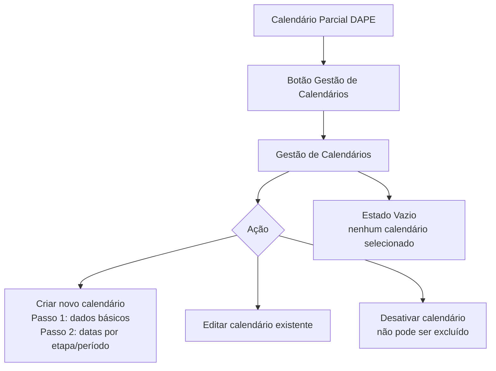
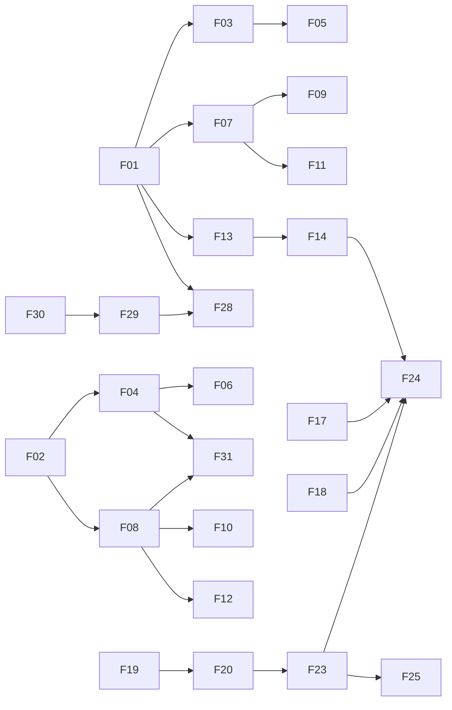

# Processos

Este documento descreve os processos do ecossistema Ladesa em dois níveis: o **workflow atual** de gestão de horários (o processo que o Ladesa apoia e moderniza) e os **fluxos de interação** mapeados no protótipo, que descrevem como cada ator realiza suas tarefas dentro do sistema.

---

## Workflow atual de gestão de horários

O processo de montagem e gestão de grades horárias em um campus federal é composto por 8 etapas sequenciais. Este é o fluxo que o Ladesa suporta e sobre o qual agrega automação e colaboração.

### Etapas do workflow

| ID | Etapa | Descrição |
|---|---|---|
| **W-001** | Configuração de infraestrutura e calendário | Cadastro de cursos, turnos de funcionamento (matutino, vespertino, noturno) e definição dos dias da semana com aula. |
| **W-002** | Mapeamento da Matriz Curricular | Cadastro individual de todas as disciplinas e atribuição da carga horária específica para cada série ou semestre de cada curso. |
| **W-003** | Definição de esquemas de horário por turma | Bloqueio ou liberação manual de horários específicos (janelas) para cada turma, obedecendo ao delineamento da direção de ensino. |
| **W-004** | Atribuição docente e disponibilidade | Vinculação de professores às disciplinas e marcação de impedimentos fixos, como teletrabalho, PRD ou atendimentos em setores. |
| **W-005** | Geração automática do horário | Execução do algoritmo para processar as restrições e gerar a grade horária inicial. |
| **W-006** | Ajuste fino e edição manual | Intervenção humana para resolver conflitos não resolvidos pelo algoritmo ou para acomodar pedidos específicos de professores, usando movimentos de arrastar e soltar. |
| **W-007** | Publicação e distribuição | Geração de arquivos e envio individual aos professores e publicação para os alunos. |
| **W-008** | Acompanhamento semanal | Gestão dinâmica de faltas, substituições e trocas pontuais que não alteram a grade semestral fixa. |

### Pontos de decisão

| ID | Decisão |
|---|---|
| **D-001** | **Gestão de acesso colaborativo:** decisão de encerrar a sessão de outro usuário para conseguir realizar edições, devido à limitação do acesso simultâneo na solução anterior. O Ladesa elimina esta restrição. |
| **D-002** | **Equivalência de sábados letivos:** definição manual de qual dia da semana o sábado irá repor (ex.: sábado com horário de segunda), com base em feriados e no calendário acadêmico. |
| **D-003** | **Exceção de intervalo intrajornada:** decisão de reduzir o intervalo de descanso entre turnos (ex.: de 1h30 para 40 minutos) para viabilizar o regime de teletrabalho de um professor específico. |
| **D-004** | **Estratégia pedagógica de agrupamento:** escolha entre manter aulas geminadas (preferência da graduação) ou separadas (preferência do integrado) para cada disciplina. |
| **D-005** | **Priorização de trocas manuais:** decisão de aceitar ou não propostas de troca feitas por professores, avaliando o impacto na logística do campus e no deslocamento docente. |

### Problemas identificados no processo atual

Os seguintes problemas foram mapeados no processo de gestão manual e com a solução legada, e motivam o desenvolvimento do Ladesa:

| ID | Problema |
|---|---|
| **P-001** | Apenas um operador por vez conseguia trabalhar no sistema — a entrada de outro usuário exigia encerrar a sessão ativa do anterior. |
| **P-002** | A distribuição dos horários era feita por arquivos estáticos enviados manualmente, sem notificação automática de atualizações. |
| **P-003** | Não havia histórico de alterações nem possibilidade de desfazer mudanças na grade. |
| **P-004** | Alunos e professores dependiam de solicitar o horário ou acessar um arquivo compartilhado, sem garantia de estar vendo a versão atual. |
| **P-005** | A lentidão do processo de configuração inicial (disciplinas, esquemas, disponibilidades) consumia tempo excessivo antes de gerar a primeira grade. |
| **P-006** | Não havia detecção automática de conflitos de professor ou sala — a conferência era manual. |
| **P-007** | Sábados letivos com equivalência de dia diferente exigiam configuração manual e propensa a erros. |
| **P-008** | O registro de indisponibilidades docentes (teletrabalho, PRD) não era integrado ao sistema de horário, exigindo controle paralelo. |
| **P-009** | Trocas pontuais de aulas não tinham fluxo de aprovação formalizado dentro do sistema. |
| **P-010** | O algoritmo de geração, quando executado novamente após edição manual, descartava os ajustes feitos, obrigando a refazer toda a edição. |
| **P-011** | Disciplinas com restrição de infraestrutura (ex.: Educação Física com ginásio externo) precisavam ser configuradas manualmente como bloqueios sem suporte nativo. |
| **P-012** | O período de recuperação semestral, com carga horária diferenciada (10% do semestre), exigia reconfigurações manuais da grade. |

---

## Fluxos de interação

Os 31 fluxos abaixo descrevem como cada ator realiza suas tarefas no sistema. Estão organizados por categoria.

### Autenticação (F01–F02)

#### F01 — Acesso ao sistema (web)

**Ator:** Todos
**Objetivo:** Entrar no sistema adequado ao papel do usuário.

```
Home (Landing LADESA)
└── Seleção de Acesso
    ├── [SISGHA] Login de Servidor
    │   ├── [Servidor] Matrícula + senha → Painel do ator
    │   └── [Aluno] Botão "Acessar como Aluno" → Seleção de Horário
    └── [SISGEA] Login SISGEA → Home - Reservas
```

Destinos pós-login:
- DAPE → Início - Acesso Rápido
- Professor → Horário da Semana (Professor)
- Aluno → Seleção de Horário
- ADM_EA → Home - Reservas

**Fluxos alternativos:**
- Acesso direto via URL (pula Home e Seleção)
- Recuperação de senha (link na tela de login — fluxo não prototipado)
- Servidor com duplo papel → pode alternar entre DAPE e Professor pelo seletor no cabeçalho após o login

---

#### F02 — Acesso ao sistema (mobile)

**Ator:** ALU, PROF
**Objetivo:** Autenticar e acessar o aplicativo mobile SISGHA.

```
Splash Screen → Loading → Login
├── [Professor] Credenciais → Home (Professor Mobile)
└── [Aluno] Botão acesso aluno → Seleção do Horário (Aluno Mobile)
```

**Fluxos alternativos:**
- Erro de autenticação → mensagem de validação exibida
- App já autenticado → pula direto para tela principal

---

### Consulta de horário (F03–F04, F07–F08)

#### F03 — Consultar horário (aluno web)

**Ator:** ALU
**Objetivo:** Visualizar o horário de aulas da própria turma.

1. Na tela de seleção, escolher ano letivo → modalidade → curso.
2. Confirmar busca → selecionar turma na lista de resultados.
3. Visualizar grade semanal da turma.
4. (Opcional) Navegar entre semanas ou alternar para visualização diária.

**Fluxos alternativos:**
- Alternar para visualização diária (tabs de dias, cards de até 3 aulas por dia)
- Voltar e trocar de turma
- Acessar calendário (→ F05)

---

#### F04 — Consultar horário (aluno mobile)

**Ator:** ALU
**Objetivo:** Visualizar horário de aulas no celular.

1. Expandir accordion hierárquico: modalidade → curso → turma.
2. Selecionar a turma → redireciona para tela de horário.
3. Visualizar aulas do dia selecionado (tabs de dia).

**Fluxos alternativos:**
- Aluno técnico integrado → tela específica; aluno de graduação → tela específica com layout curricular adaptado
- Acessar calendário (→ F06) via botão ou Navbar-Footer

---

#### F07 — Consultar horário (professor web)

**Ator:** PROF
**Objetivo:** Visualizar o próprio horário semanal de aulas.

1. Após o login, aterrissar diretamente na tela de Horário da Semana.
2. (Opcional) Navegar entre semanas ou alternar para visualização diária.

**Fluxos alternativos:**
- Visualização diária (tabs de dias Seg–Sáb, cards de até 3 aulas)
- Acessar via Sidebar → opção "Início"

---

#### F08 — Consultar horário (professor mobile)

**Ator:** PROF
**Objetivo:** Verificar aulas do dia no celular.

1. Na tela principal, visualizar aulas do dia atual.
2. (Opcional) Trocar dia da semana pelas tabs.

**Fluxos alternativos:**
- Acessar calendário ou perfil via Navbar-Footer

---

### Consulta de calendário (F05–F06, F09–F10)

#### F05 — Consultar calendário (aluno web)

**Ator:** ALU
**Objetivo:** Visualizar o calendário acadêmico com eventos.

1. Navegar para calendário a partir do horário.
2. Visualizar calendário mensal com eventos ao lado.
3. (Opcional) Navegar entre meses.
4. (Opcional) Clicar em evento para ver detalhes (modal de eventos).

**Fluxo alternativo:** alternar para visão anual (12 meses simultâneos) via toggle.

---

#### F06 — Consultar calendário (aluno mobile)

**Ator:** ALU
**Objetivo:** Consultar calendário acadêmico e eventos no celular.

1. Acessar via Navbar-Footer ou botão de calendário.
2. (Opcional) Buscar calendário específico por formação/curso.
3. Visualizar calendário mensal e eventos do mês.
4. (Opcional) Ver lista completa de eventos.

---

#### F09 — Consultar calendário (professor web)

**Ator:** PROF
**Objetivo:** Consultar calendário acadêmico para planejamento pedagógico.

1. Acessar via Sidebar → Calendário.
2. Selecionar filtros: ano letivo, modalidade, curso.
3. Visualizar calendário mensal com eventos ao lado.

**Fluxo alternativo:** alternar para visão anual; ver detalhes de eventos via modal.

---

#### F10 — Consultar calendário (professor mobile)

**Ator:** PROF
**Objetivo:** Consultar calendário e eventos no celular.

1. Acessar via Navbar-Footer ou botão na tela principal.
2. (Opcional) Buscar calendário específico.
3. Visualizar calendário mensal e eventos.
4. (Opcional) Ver todos os eventos em lista.

---

### Gestão de perfil (F11–F12, F27)

#### F11 — Editar perfil (professor web)

**Ator:** PROF
**Objetivo:** Atualizar dados pessoais e visualizar vínculos acadêmicos.

1. Acessar Perfil via Sidebar.
2. Visualizar dados pessoais, campus, ensino (disciplinas/turmas) e disponibilidade.
3. Clicar em editar → preencher modal de edição → salvar.

---

#### F12 — Editar disponibilidade (professor mobile)

**Ator:** PROF
**Objetivo:** Atualizar grade de disponibilidade para lecionar.

1. Acessar Perfil via Navbar-Footer.
2. Garantir que está na aba "Disponibilidade".
3. Clicar nas células da grade para marcar/desmarcar disponibilidade por dia e turno.

**Fluxo alternativo:** alternar para aba "Ensino" para ver disciplinas e turmas vinculadas (somente leitura).

---

#### F27 — Editar perfil (DAPE)

**Ator:** DAPE
**Objetivo:** Atualizar dados pessoais, disponibilidade e campus.

1. Acessar Perfil via Sidebar.
2. Visualizar perfil completo.
3. Editar dados pessoais (modal), disponibilidade (modal) ou campus vinculado (modal) separadamente.

---

### Gestão de horário DAPE (F13–F16)

#### F13 — Visualizar horários (DAPE)

**Ator:** DAPE
**Objetivo:** Consultar horários de qualquer professor ou turma do campus.



---

#### F14 — Editar horário de turma/professor (DAPE)

**Ator:** DAPE
**Objetivo:** Modificar a grade horária de uma turma ou professor específico.



**Regras aplicadas:** RN-09, RN-10, RN-11, RN-15, RN-22.

**Fluxos alternativos:**
- Cancelar edição sem salvar
- Evento global → sistema redireciona para Gestão de Eventos (F24)
- Chegar via visualização por Turma em vez de Professor

---

#### F15 — Gerar horário automático (DAPE)

**Ator:** DAPE
**Objetivo:** Gerar automaticamente uma grade de horários otimizada.

1. Acessar via Início → botão "Gerar Horário".
2. Selecionar tipo: permanente (substitui o existente) ou temporário (prévia sem substituir).
3. Configurar parâmetros no modal.
4. Iniciar geração → aguardar processamento → confirmar resultado.

**Fluxos alternativos:**
- Rejeitar resultado e gerar novamente
- Aceitar resultado e ir para visualização/edição (→ F13/F14)

---

#### F16 — Configurar intervalos de aula (DAPE)

**Ator:** DAPE
**Objetivo:** Definir os horários de início e fim de cada aula por turno.

1. Acessar via Sidebar → Gestão → Intervalos.
2. Selecionar campus e fuso horário.
3. Visualizar os 3 turnos (Matutino, Vespertino, Noturno) com seus intervalos.
4. Editar horário de início e fim de cada intervalo → salvar.

---

### Gestão acadêmica (F17–F22)

#### F17 — Gerenciar turmas (DAPE)

**Ator:** DAPE
**Objetivo:** Cadastrar, editar e gerenciar eventos de turmas.

1. Sidebar → Gestão → Turmas.
2. Buscar turma.
3. Criar nova turma (modal) **ou** editar turma existente **ou** gerenciar eventos da turma.

**Nota:** eventos de turmas que são compartilhados globalmente redirecionam para a Gestão de Eventos (F24).

---

#### F18 — Gerenciar usuários (DAPE)

**Ator:** DAPE
**Objetivo:** Cadastrar, editar servidores e gerenciar agendas de professores.

1. Sidebar → Gestão → Usuários.
2. Buscar usuário.
3. Criar novo usuário (modal com condicional: seção de disponibilidade aparece apenas se função = Professor) **ou** editar usuário existente **ou** gerenciar agenda do professor.

**Regras aplicadas:** RN-45, RN-46, RN-47.

---

#### F19 — Gerenciar cursos (DAPE)

**Ator:** DAPE
**Objetivo:** Cadastrar e editar cursos com disciplinas por período.

1. Sidebar → Ensino → Cursos.
2. Criar novo curso (2 passos: dados básicos + seleção de disciplinas por período) **ou** editar curso existente.

---

#### F20 — Gerenciar formações (DAPE)

**Ator:** DAPE
**Objetivo:** Cadastrar formações acadêmicas e definir etapas por período.

1. Acessar via Cursos ou link contextual.
2. Criar nova formação (2 passos: dados básicos + definição de etapas) **ou** editar formação existente.

**Regras aplicadas:** RN-38, RN-39, RN-40, RN-41, RN-44.

---

#### F21 — Gerenciar disciplinas (DAPE)

**Ator:** DAPE
**Objetivo:** Cadastrar e editar disciplinas do catálogo acadêmico.

1. Sidebar → Ensino → Disciplinas.
2. Criar nova disciplina (modal) **ou** editar disciplina existente.

---

#### F22 — Gerenciar diários de classe (DAPE)

**Ator:** DAPE
**Objetivo:** Registrar e manter diários de classe por disciplina.

1. Sidebar → Gestão → Diários ou Início → Acesso Rápido → Diários.
2. Criar novo diário (Passo 1: selecionar turma e disciplina → Passo 2: preencher detalhes) **ou** editar diário existente (turma não pode ser alterada).

**Regras aplicadas:** RN-50, RN-51, RN-52.

---

### Gestão do calendário acadêmico (F23–F25)

#### F23 — Gerenciar calendário acadêmico (DAPE)

**Ator:** DAPE
**Objetivo:** Criar, editar e desativar calendários acadêmicos.



**Regras aplicadas:** RN-31, RN-32, RN-33, RN-34.

---

#### F24 — Gerenciar eventos (DAPE)

**Ator:** DAPE
**Objetivo:** Criar e editar eventos acadêmicos globais compartilhados entre turmas e professores.

1. Calendário → botão Gestão de Eventos.
2. Filtrar eventos existentes (tipo, formação, curso, período, busca).
3. Criar novo evento global:
   - Preencher título, tipo, cor, datas, horários.
   - Marcar "Dura todo o dia" → esconde campos de horário.
   - Selecionar formações participantes → accordions por formação para selecionar turmas e professores.
   - Marcar "Todos participam" → desabilita seleção individual.
4. Editar evento existente.

**Fluxo alternativo:** eventos do tipo "atividade" ou "indisponibilidade" de professor abrem modal específico da agenda com aviso informativo.

**Regras aplicadas:** RN-22, RN-23, RN-24, RN-25, RN-26.

---

#### F25 — Gerenciar dias não letivos (DAPE)

**Ator:** DAPE
**Objetivo:** Cadastrar e consultar dias sem aula.

1. Calendário → botão Dias Não Letivos.
2. Visualizar calendário mensal com marcações de dias não letivos.
3. Cadastrar novo dia não letivo (modal com nome/motivo e data(s)).

**Fluxo alternativo:** alternar para visão anual consolidada (blocos mensais com dias não letivos agrupados por mês).

---

### Relatórios (F26)

#### F26 — Gerar relatório de aulas ministradas (DAPE)

**Ator:** DAPE
**Objetivo:** Gerar e exportar relatório de aulas por professor e semestre.

1. Início → Acesso Rápido → Relatórios.
2. Selecionar professor (obrigatório) e semestre (obrigatório).
3. (Opcional) Aplicar filtros adicionais.
4. Visualizar prévia no modal **ou** exportar diretamente como PDF.

---

### SISGEA — Gestão de ambientes (F28–F30)

#### F28 — Gerenciar reservas de ambiente (SISGEA)

**Ator:** ADM_EA
**Objetivo:** Criar e gerenciar reservas de espaços físicos.

1. Após o login, acessar Home - Reservas.
2. Selecionar dia na grade semanal.
3. Visualizar reservas do dia.
4. Criar nova reserva clicando em horário vazio (modal de reserva).
5. No modal: navegar entre dias via setas; selecionar local disponível.

---

#### F29 — Gerenciar ambientes (SISGEA)

**Ator:** ADM_EA
**Objetivo:** Cadastrar e editar espaços físicos reserváveis.

1. Sidebar → Ambientes.
2. Criar novo ambiente (modal) **ou** editar ambiente existente.

---

#### F30 — Gerenciar blocos (SISGEA)

**Ator:** ADM_EA
**Objetivo:** Cadastrar e editar edificações do campus.

1. Sidebar → Blocos.
2. Criar novo bloco (modal) **ou** editar bloco existente.

---

### Comunicação (F31)

#### F31 — Consultar notificações (mobile)

**Ator:** ALU, PROF
**Objetivo:** Verificar avisos e notificações do sistema.

1. Tocar no ícone de sino no cabeçalho do app.
2. Visualizar lista de notificações em cards.

**Nota:** no desktop, as notificações são acessadas via dropdown no cabeçalho principal — não há tela dedicada.

---

## Mapa de dependências entre fluxos



---

## Resumo estatístico

| Categoria | Fluxos | Atores |
|---|---|---|
| Autenticação | F01, F02 | Todos |
| Consulta de horário | F03, F04, F07, F08 | ALU, PROF |
| Consulta de calendário | F05, F06, F09, F10 | ALU, PROF |
| Gestão de perfil | F11, F12, F27 | PROF, DAPE |
| Gestão de horário | F13, F14, F15, F16 | DAPE |
| Gestão acadêmica | F17, F18, F19, F20, F21, F22 | DAPE |
| Gestão do calendário | F23, F24, F25 | DAPE |
| Relatórios | F26 | DAPE |
| Gestão de ambientes | F28, F29, F30 | ADM_EA |
| Comunicação | F31 | ALU, PROF |
| **Total** | **31** | |
