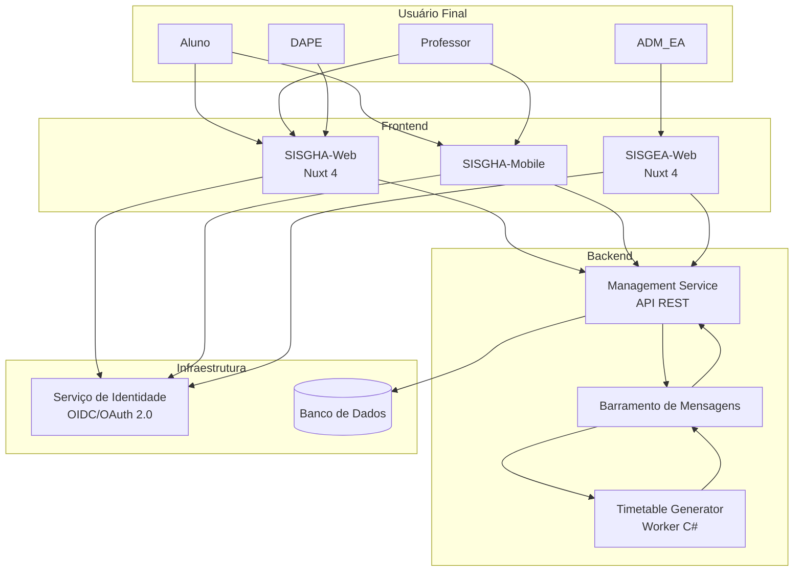

# Integração entre Sistemas

Este documento descreve as fronteiras de sistema, os dados compartilhados, os fluxos de integração e as dependências entre os componentes do ecossistema Ladesa: **SISGHA-Web**, **SISGHA-Mobile**, **SISGEA-Web** e o **worker de geração de horários** (timetable-generator).

---

## Fronteiras de Sistema

O ecossistema Ladesa é composto por sistemas distintos com responsabilidades bem definidas:

| Sistema | Responsabilidade | Atores atendidos |
|---|---|---|
| **SISGHA-Web** | Gestão acadêmica completa: horários, calendários, entidades, relatórios | DAPE, Professor, Aluno (web) |
| **SISGHA-Mobile** | Consulta de horário e calendário, perfil e disponibilidade docente | Professor, Aluno (mobile) |
| **SISGEA-Web** | Gestão de infraestrutura física: blocos, ambientes, reservas de salas | ADM_EA (administrador de ambientes) |
| **Timetable Generator** | Worker assíncrono de otimização para geração automática de grade de horários | Interno (invocado pelo SISGHA-Web) |
| **Serviço de Identidade** | Autenticação e autorização centralizada via protocolo OIDC/OAuth 2.0 | Todos os sistemas |
| **Management Service** | API de backend com os CRUDs acadêmicos, calendário e regras de negócio | SISGHA-Web, SISGHA-Mobile |

---

## Diagrama de Fluxo de Dados



---

## Dados Compartilhados entre Sistemas

Algumas entidades de domínio são transversais — são criadas em um sistema e consumidas por outros:

### Entidades de domínio transversais

| Entidade | Criada em | Consumida em | Observação |
|---|---|---|---|
| Usuário (Servidor) | SISGHA-Web (DAPE) | SISGHA-Web, SISGHA-Mobile, Serviço de Identidade | Autenticação via OIDC |
| Campus | Gerenciado externamente | SISGHA-Web, SISGHA-Mobile | Sem CRUD no protótipo; entidade de referência |
| Turno | SISGHA-Web (Intervalos) | SISGHA-Web, SISGHA-Mobile | Base temporal para grades |
| Dia da Semana | Domínio fixo (seg–sáb) | SISGHA-Web, SISGHA-Mobile, SISGEA-Web | Constante: 6 dias letivos |
| Formação | SISGHA-Web (DAPE) | SISGHA-Web (Calendário, Cursos, Eventos) | Entidade raiz da cascata acadêmica |

### Sessão e identidade

A autenticação é centralizada e compartilhada via token de acesso (OIDC). O SISGHA e o SISGEA possuem telas de login independentes, mas ambos delegam a validação de credenciais ao mesmo serviço de identidade institucional. A sessão não é compartilhada entre SISGHA e SISGEA — o usuário deve autenticar-se separadamente em cada sistema.

---

## Fluxos de Integração Identificados no Protótipo

### Fluxo 1 — Seleção de Sistema (Landing Page)

A landing page e a tela de Seleção de Acesso são o único ponto de interface compartilhado entre SISGHA e SISGEA. A partir da seleção, cada sistema segue seu próprio fluxo de autenticação e navegação de forma independente.

```
Landing Page → Seleção de Acesso → [SISGHA Login] ou [SISGEA Login]
```

### Fluxo 2 — Autenticação de Servidor (SISGHA)

O SISGHA-Web e o SISGHA-Mobile delegam a autenticação ao serviço de identidade e recebem de volta os papéis do usuário (DAPE, Professor) para controle de acesso (RBAC).

```
Login → Serviço de Identidade (OIDC) → Token com papéis → SISGHA-Web/Mobile
```

### Fluxo 3 — Geração Automática de Horário (SISGHA-Web → Worker)

A geração automática é um processo assíncrono. O SISGHA-Web envia uma solicitação ao backend, que publica uma mensagem no barramento. O worker (timetable-generator) consome a mensagem, executa o solver e publica o resultado. O backend processa a resposta e notifica o frontend.

```
DAPE solicita geração → Management Service publica mensagem →
Timetable Generator executa solver → publica resultado →
Management Service persiste grade → SISGHA-Web exibe resultado
```

### Fluxo 4 — Consulta de Horário (Mobile → API)

O SISGHA-Mobile consome os mesmos endpoints da API do Management Service que o SISGHA-Web, recebendo os dados de horário e calendário formatados. A lógica de negócio reside no backend — o mobile apenas apresenta os dados.

```
SISGHA-Mobile → Management Service API → Dados de horário/calendário
```

### Fluxo 5 — Notificações (Management Service → Frontend)

Quando o DAPE realiza alterações de horário ou eventos, o sistema gera notificações automáticas. O mecanismo de entrega (push, polling ou WebSocket) deve ser definido na implementação, mas o fluxo lógico é:

```
Alteração de horário/evento → Management Service gera notificação →
Entrega para SISGHA-Web (dropdown) e SISGHA-Mobile (tela dedicada)
```

---

## Integrações Futuras Potenciais

As integrações a seguir não estão presentes no protótipo atual, mas foram identificadas como potencialmente relevantes com base no domínio e nos sistemas existentes:

| Integração | Sistemas envolvidos | Descrição |
|---|---|---|
| Reserva de sala ↔ Horário acadêmico | SISGEA-Web ↔ SISGHA-Web | Ao gerar ou editar horário, o SISGHA consulta o SISGEA para validar disponibilidade de salas. |
| Importação de dados institucionais | Sistemas institucionais externos ↔ SISGHA | Importação de turmas, professores e alunos de sistemas acadêmicos institucionais existentes (ex: integração via API ou arquivo). |
| Exportação de grade para portais | SISGHA-Web → Portais externos | Publicação da grade de horários em formatos consumíveis por outros sistemas institucionais (ex: portais do aluno). |
| Notificação por canal externo | Management Service → Canal de mensagens | Entrega de notificações via e-mail institucional ou aplicativo de mensagens, além das notificações internas do sistema. |

---

## Contratos de API

### Padrão de API

A API do Management Service segue convenções REST com contratos definidos via **TypeSpec** (conforme decisão arquitetural ADR-010). Os contratos tipados garantem consistência entre a especificação e a implementação.

Padrões observados na implementação de referência:

- Endpoints REST com prefixo de versão (ex: `/api/v1/...`)
- Autenticação via Bearer Token (JWT emitido pelo serviço de identidade)
- Paginação por cursor ou offset para listagens
- Respostas em formato JSON com envelopes padronizados
- Códigos HTTP semânticos (200, 201, 400, 401, 403, 404, 422, 500)

### Grupos de endpoints identificados

| Grupo | Descrição | Atores |
|---|---|---|
| `/auth` | Autenticação e gestão de sessão | Todos |
| `/usuarios` | CRUD de servidores e disponibilidade | DAPE, PROF (próprio perfil) |
| `/turmas` | CRUD de turmas e eventos de turma | DAPE |
| `/cursos` | CRUD de cursos e vínculo com disciplinas | DAPE |
| `/formacoes` | CRUD de formações e etapas | DAPE |
| `/disciplinas` | CRUD de catálogo de disciplinas | DAPE |
| `/horarios` | Consulta, edição e geração de horários | DAPE, PROF (leitura), ALU (leitura) |
| `/calendarios` | CRUD de calendários acadêmicos | DAPE |
| `/eventos` | CRUD de eventos globais e por entidade | DAPE |
| `/dias-nao-letivos` | CRUD de dias não letivos | DAPE |
| `/diarios` | CRUD de diários de classe | DAPE |
| `/relatorios` | Geração e exportação de relatórios | DAPE |
| `/notificacoes` | Consulta de notificações | PROF, ALU |
| `/intervalos` | Configuração de intervalos de aula | DAPE |
| `/blocos` | CRUD de blocos (SISGEA) | ADM_EA |
| `/ambientes` | CRUD de ambientes (SISGEA) | ADM_EA |
| `/reservas` | CRUD de reservas de ambientes (SISGEA) | ADM_EA |

---

## Eventos e Mensagens

O ecossistema utiliza troca de mensagens entre o Management Service e o Timetable Generator para desacoplar o processamento assíncrono do solver da API síncrona.

### Mensagens identificadas

| Mensagem | Direção | Descrição |
|---|---|---|
| `horario.geracao.solicitada` | Management Service → Timetable Generator | Solicitação de geração com parâmetros (campus, turmas, modo permanente/temporário) |
| `horario.geracao.concluida` | Timetable Generator → Management Service | Grade gerada com sucesso; inclui o resultado para persistência |
| `horario.geracao.falhou` | Timetable Generator → Management Service | Falha na geração; inclui motivo para exibição ao DAPE |
| `horario.alterado` | Management Service → Frontend (via push/polling) | Notificação de alteração de horário para professores e alunos afetados |
| `evento.criado` | Management Service → Frontend | Notificação de novo evento no calendário |

> As definições formais de mensagens devem ser mantidas no diretório `messages/` do repositório, seguindo o contrato estabelecido entre os serviços.

---

## Decisões de Integração

| Decisão | Justificativa |
|---|---|
| SISGHA e SISGEA com logins separados | Os sistemas atendem atores distintos (servidores acadêmicos vs. administradores de ambientes) com contextos independentes. Sessão unificada seria possível via SSO, mas não está prevista no protótipo atual. |
| Geração de horário como processo assíncrono | O solver pode levar até 60 segundos (RNF-001). Processar de forma síncrona bloquearia a API e degradaria a experiência. O modelo assíncrono com mensagens desacopla o processo. |
| Contratos de API via TypeSpec | Garante consistência entre especificação e implementação, facilita geração de SDKs para o frontend e evita divergências manuais. |
| Mobile consome a mesma API que o web | Evita duplicação de lógica de negócio. A API do Management Service é o único ponto de verdade; o mobile é um consumidor como o web. |
